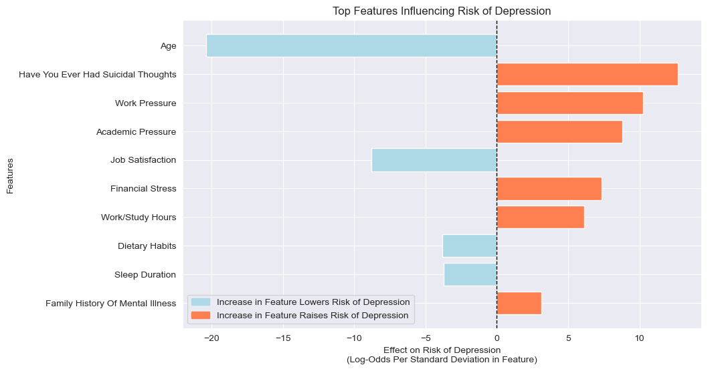
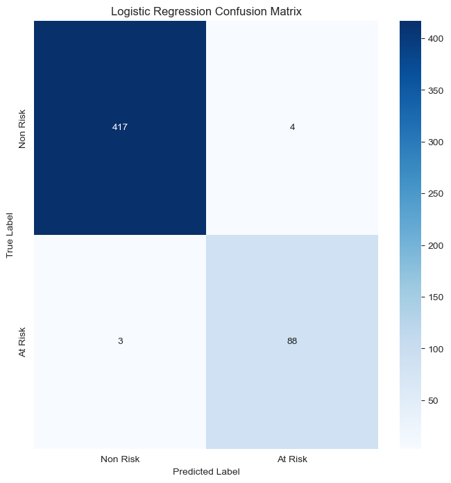

# Depression Survey Analysis
Author: Elijah Lopez

Understanding risk factors for depression is of utmost importance to medical experts for diagnostic purposes. By identifying risk factors early, these experts can open communication with patients, build trust, and make informed recommendations focusing on holistic care. This analysis investigates the responses of 2,500+ adults (ages 18-60) to better understand the factors contributing to depression risk. In it, we reveal how responses between at-risk and non-risk groups differ at a significant level. Through machine modeling, we identify which factors are contributing most to depression risk and highlight strategies to promote improved mental health through lifestyle changes and with professional support.

## Business Problem
Current diagnostic practices for depression often depend on subjective clinical evaluations, which may overlook subtle yet critical lifestyle behaviors and stress factors. To enhance diagnostic accuracy and improve intervention strategies, we must identify and quantify the behavioral indicators that distinguish at-risk individuals from their non-risk counterparts.

## Data
This data was retrieved from [Kaggle](https://www.kaggle.com/datasets/sumansharmadataworld/depression-surveydataset-for-analysis) and was originally collected between January 2023 and June 2023. It includes volunteered information from survey participants on age, gender, city, degree, job satisfaction, study satisfaction, study/work hours, and family history of mental illness, among others. Participants were asked to provide inputs without requiring any professional mental health assessments or diagnostic test scores. The target variable, 'Depression', represents whether the individual is at risk of depression, marked as 'Yes' or 'No', based on their responses to lifestyle and demographic factors.

## Methods
There are four main focuses of this work:
1. Understand the demographic makeup of survey participants.
2. Identify key differences in depression risk groups (at risk vs non-risk).
3. Identify which factors contribute most to risk of depression.
4. Create a model to accurately classify whether a respondent is at risk of depression or not.

This analysis incorporated the following strategies to reach its conclusions.
* Imputation of null values:
    * Filled non-student nulls in 'academic pressure' with 1, indicating that those that did not respond do not experience academic pressure.
    * Filled non-working nulls in 'work pressure' with 1, indicating that those that did not respond do not experience work pressure.
    * Filled non-student nulls in 'study satisfaction' with 3, indicating that those that did not respond will be neutral.
    * Filled non-working professionals nulls in 'job satisfaction' with 3, indicating that those that did not respond will be neutral.
* Encoding of values:
    * Gender (binary)
    * Working Professional or Student (binary)
    * Sleep Duration (ordinal)
    * Dietary Habits (ordinal)
    * Have You Ever Had Suicidal Thoughts? (binary)
    * Family History of Mental Illness (binary)
    * Depression (binary)
    * City  (one hot encoding)
    * Degree (one hot encoding)

We chose `Recall` as our metric of evaluation for our machine learning model. This is because it minimizes our false negative rate, thereby supporting medical professionals to most accurately indentify individuals at risk of depression.

## Results
This analysis shows that there are statistically significant differences in many response categories between depression risk groups. Those at risk of depression are primarily younger in age, students with at most a high school education, have poor sleeping habits, and are not eating well. They also more commonly identify as having past thoughts of suicide and have real or perceived:
* Increased academic pressure
* Increased work pressure
* Decreased job satisfaction
* Increased amounts of time working/studying 
* Increased financial stress

---------------------------------------------------------------------------
| `Risk Factor`             | `At Risk` (Avg)      | `Not at Risk` (Avg)  |
| ------------------------- | -------------------- | -------------------- |
| Age                       | 26                   | 42                   |
| Academic Pressure         | 3.6                  | 2.3                  |
| Work Pressure             | 3.9                  | 2.9                  |
| Study Satisfaction        | 2.7                  | 3.5                  |
| Job Satisfaction          | 2.3                  | 3.1                  |
| Work/Study Hours          | 7.3                  | 5.8                  |
| Financial Stress          | 3.5                  | 2.9                  |
| Occupation                | Student              | Working Professional |
| Sleep Duration            | < 5 Hours            | 7-8 Hours            |
| Dietary Habits            | Unhealthy            | Healthy              |
| Degree                    | Class 12             | Class 12             |
| Prev. Thoughts of Suicide | Yes                  | No                   |
---------------------------------------------------------------------------

By evaluating the coefficients of our Logistic Regression model we were able to identify which features contribute most to depression risk and their relationship was positively or negatively associated.

Final model performance for `Logistic Regression` was, as a percentage:
* Accuracy: 99
* Precision: 96
* `Recall`: 97
* F1: 96
* ROC-AUC: 98

The model predictions can be seen in this confustion Matrix:

## Conclusions
This survey is based on individual self-reporting and does not include any medical data related to depression diagnoses. While the survey falls short of offering clincial information, it is still helpful to consider risk factors for depression so that medical professionals can make accurate diagnoses and tailor recommendations for holistic care. By leveraging this machine model, medical professionals can more accurately identify individuals at risk of depression based on their survey responses.

Proactive communciation with patients is of utmost importance to build trust, learn which factors are contributing most to their mental health, and to provide tailored recommendations to support their wellbeing. By understanding the contributing factors to depression, medical professionals can work collaboratively with patients to promote a healthly lifestyle. This includes:
* Establishing a positive work-life/student-life balance.
* Creating and maintaing a healthy diet.
* Creating and committing to a conducive sleep schedule.
* Offering resources for stress management, nutrtion support, and/or financial planners.

## Next Steps
Understanding the habits and stresses individuals face is only part of the solution and more research can be conducted in clincial setting to better understand contributing factors to mental wellness and depression. Additional areas of interest include:
* Time spent on hobbies
* Time spent with friends and loved ones
* Time spent exercising
* Consumption habits of alcohol/narcotics
* Major life events
* Past trauma

Additionally, a larger survey sample may also be needed to generalize better to the greater population and ensure each demographic group is represented equitably.

## For More Information
See the full analysis:
* [EDA Jupyter Notebook](https://github.com/elijahlopez94/depression_survey_analysis/blob/main/eda.ipynb)
* [ML Jupyter Notebook](https://github.com/elijahlopez94/depression_survey_analysis/blob/main/ml.ipynb)

For additional info, contact the author at:

Elijah Lopez | elijahlopez94@gmail.com